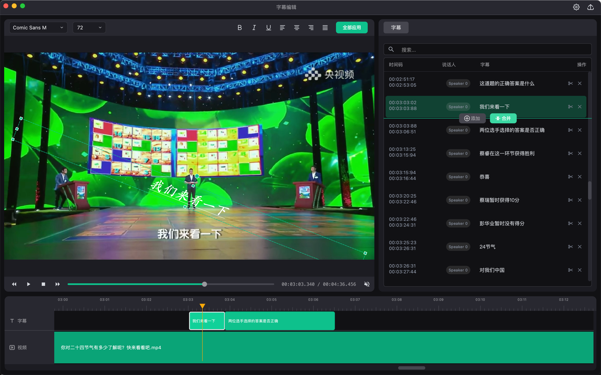
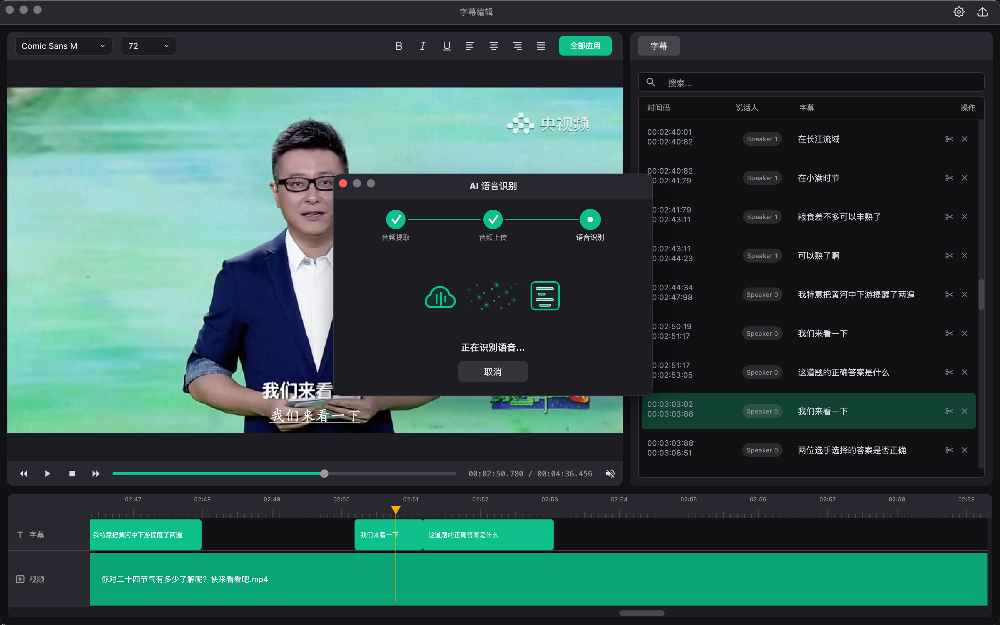
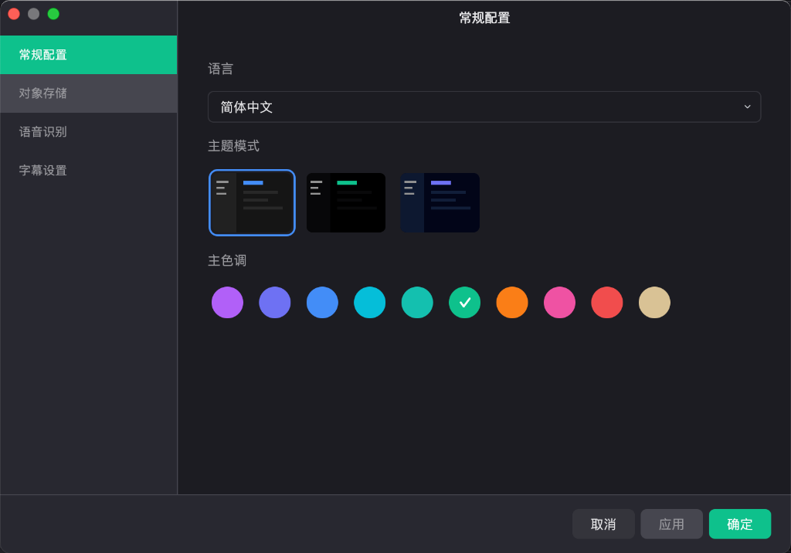
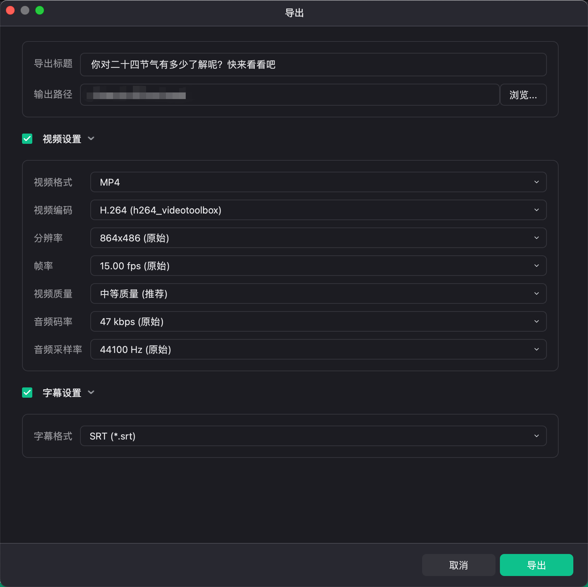
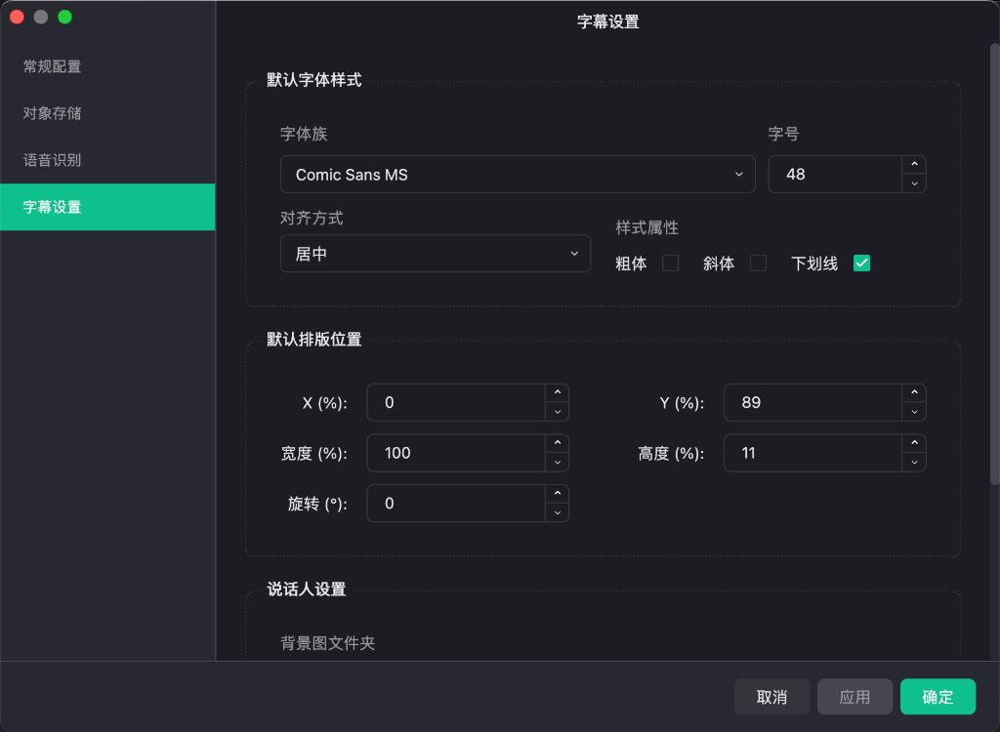

# Subtitles Editor

一个基于 C++17 和 Qt6 开发的 macOS 视频字幕编辑器，提供直观的时间轴编辑界面和实时视频预览功能。

> 💡 **Vibe Coding 项目**：本项目完全通过 AI 辅助编程（Vibe Coding）方式开发完成，展示了人机协作的开发模式。

## ✨ 功能特性

### 🎬 视频播放
- 支持多种视频格式：MP4、MKV、AVI、MOV
- 实时视频预览与字幕叠加显示
- 流畅的播放控制（播放、暂停、跳转、倍速）

### 📝 字幕编辑
- 可视化时间轴编辑界面
- 支持字幕的添加、编辑、删除和排序
- 精确的时间码调整（毫秒级）
- 字幕搜索和批量操作
- 多选模式支持批量修改

### 📤 导出支持
- **SRT** - 最通用的字幕格式
- **ASS** - 支持高级样式
- **Premiere Pro XML** - 与 Adobe Premiere Pro 无缝集成
- **Final Cut Pro XML** - 与 Final Cut Pro 无缝集成

### 🎨 界面设计
- 深色/浅色主题切换
- 自定义主题色
- 响应式布局，支持面板拖拽调整

### 🔧 高级功能
- ASR 语音识别（支持本地离线 Whisper.cpp 识别与腾讯云 ASR 云端识别）
- 本地 ASR 支持参数微调（如最大字幕长度、智能标点分割及繁简体转换等）
- 对象存储（腾讯云、阿里云）
- 多语言国际化支持
- 项目管理与自动保存

## 💻 平台支持

| 平台 | 状态 | 备注 |
|------|------|------|
| macOS (Apple Silicon / Intel) | ✅ 已验证 | macOS 12+，支持 M 系列芯片及 Intel 芯片 |
| Windows (x64) | ✅ 已验证 | Windows 10/11 x64 |

## 🖼️ 界面预览

| 主编辑界面 | AI 语音识别 |
| :---: | :---: |
|  |  |

| 常规配置 | 导出设置 | 字幕设置 |
| :---: | :---: | :---: |
|  |  |  |

## 📥 下载

前往 [GitHub Releases](https://github.com/zxl212630/subtitles-editor/releases) 页面下载最新版本。

> ⚠️ **注意**：macOS 版本为未签名版本，首次打开可能会遇到安全提示。

## ❓ 常见问题

### macOS 提示"无法打开，因为无法验证开发者"

由于应用未签名，macOS 可能会阻止打开。有三种解决方法：

1. **方法一**：前往 系统偏好设置 > 安全性与隐私，点击"仍要打开"
2. **方法二**：右键点击应用，选择"打开"，在弹出窗口中点击"打开"
3. **方法三**：在终端执行以下命令：
   ```bash
   xattr -cr /Applications/subtitles-editor.app
   ```

## 📦 依赖项

| 依赖 | 版本 | 用途 |
|------|------|------|
| Qt6 | 6.5+ | UI 框架 |
| FFmpeg | 8.0 | 视频/音频解码 |
| whisper.cpp | 1.5.0+ | 本地离线 ASR 语音识别引擎 |
| QWindowKit | - | 自定义标题栏 |

## 🚀 构建指南

### 环境准备

确保已安装以下依赖：
- CMake 3.20+
- Qt6 6.5+
- FFmpeg 8.0+
- QWindowKit 1.5.0
- C++17 兼容的编译器 (MSVC 2019+ 或 Clang/GCC)

### 构建步骤 (macOS / Linux)

```bash
# 克隆仓库
git clone https://github.com/zxl212630/subtitles-editor.git
cd subtitles-editor

# 配置（如果 SDK 安装在非默认路径，可通过 -D 参数手动覆盖，详见下方说明）
cmake -B cmake-build-debug -S .

# 编译
cmake --build cmake-build-debug
```

### 构建步骤 (Windows - MSVC)

```powershell
# 克隆仓库
git clone https://github.com/zxl212630/subtitles-editor.git
cd subtitles-editor

# 配置 (通过命令行传入相关的依赖 SDK 路径，或确保其已添加到系统变量)
cmake -B cmake-build-debug -S . `
  -DQt6_ROOT="C:/Qt/6.5.7/msvc2019_64" `
  -DQWindowKit_ROOT="C:/Tools/QWindowKit" `
  -DFFmpeg_ROOT="C:/Tools/ffmpeg"

# 编译
cmake --build cmake-build-debug --config Debug
```

### SDK 路径配置说明

默认情况下，`CMakeLists.txt` 会根据操作系统查找默认安装路径。若你的环境不同，可以在配置时手动覆盖：

| 参数 | 说明 | macOS 默认值 | Windows 默认值 |
|------|------|--------------|----------------|
| `-DQt6_ROOT` | Qt6 安装根目录 | `~/Tools/Qt/6.5.7` | `C:/Qt/6.5.7/msvc2019_64` |
| `-DQWindowKit_ROOT` | QWindowKit 安装根目录 | `~/Tools/Qt/QwindowKit/Qt6` | `C:/Tools/QWindowKit` |
| `-DFFmpeg_ROOT` | FFmpeg 编译根目录 | `~/Tools/ffmpeg/8.0` | `C:/Tools/ffmpeg` |
| `-Dwhisper_ROOT` | whisper.cpp 安装根目录 | `~/Tools/whisper` | `C:/Tools/whisper` |

## 📁 项目结构

```
subtitles-editor/
├── include/          # 头文件
├── src/              # 源文件
├── resources/        # 资源文件（图标、翻译等）
├── CMakeLists.txt    # CMake 配置
└── README.md
```

### 核心模块

| 模块 | 文件 | 功能 |
|------|------|------|
| 主窗口 | `AppWindow` | 应用主窗口，管理整体布局 |
| 字幕轨道 | `SubtitleTrack` | 字幕数据模型 |
| 字幕列表 | `SubtitleListPanel` | 左侧面板，搜索与列表 |
| 视频预览 | `VideoPreviewPanel` | 右侧面板，视频播放与显示 |
| 时间轴 | `TimelinePanel` | 底部面板，时间轴编辑 |
| 导出器 | `SubtitleExporter` | 多格式字幕导出 |
| ASR 服务 | `AsrServiceBase` | 语音识别抽象接口 |
| 本地 ASR 实现 | `WhisperAsrService` | 基于 whisper.cpp 的本地语音识别服务 |

## 🎯 使用说明

1. **导入视频**：通过菜单或拖拽方式导入视频文件
2. **编辑字幕**：在时间轴上添加或选择字幕，输入文本内容
3. **调整时间**：拖动时间轴上的字幕块或手动输入时间码
4. **预览效果**：实时查看字幕在视频中的显示效果
5. **导出字幕**：选择所需格式导出字幕文件

## 🛠️ 开发工具

```bash
# 代码格式化（提交前必须执行）
clang-format -i src/*.cpp include/*.h

# 静态分析
clang-tidy src/*.cpp -- -std=c++17
```

## 📄 许可证

本项目采用 **GPLv3** 许可证，详见 [LICENSE](LICENSE) 文件。

### 第三方开源组件声明

本项目包含或使用了以下第三方开源组件：

1. **Qt6**:
   - **项目地址**: [https://www.qt.io](https://www.qt.io) / [GitHub](https://github.com/qt)
   - **许可证**: LGPLv3 / 商业许可证
   - **说明**: 跨平台的 C++ 开发框架，用于构建精美的用户界面与多媒体功能。
2. **srtparser.h** (位于 `include/srtparser.h`):
   - **项目地址**: [saurabhshri/simple-yet-powerful-srt-subtitle-parser-cpp](https://github.com/saurabhshri/simple-yet-powerful-srt-subtitle-parser-cpp)
   - **作者**: Saurabh Shrivastava / Oleksii Maryshchenko ([LibSub-Parser](https://github.com/young-developer/subtitle-parser))
   - **许可证**: MIT 许可证
   - **说明**: 优秀的 C++ SRT 字幕解析组件。
3. **QWindowKit**:
   - **项目地址**: [stdware/qwindowkit](https://github.com/stdware/qwindowkit)
   - **许可证**: Apache-2.0
   - **说明**: 用于实现跨平台无边框窗口和自定义标题栏。
4. **FFmpeg**:
   - **项目地址**: [https://ffmpeg.org](https://ffmpeg.org) / [GitHub](https://github.com/FFmpeg/FFmpeg)
   - **许可证**: LGPL / GPL
   - **说明**: 用于高效率的音视频解码与多媒体数据处理。
5. **whisper.cpp**:
   - **项目地址**: [https://github.com/ggerganov/whisper.cpp](https://github.com/ggerganov/whisper.cpp)
   - **许可证**: MIT 许可证
   - **说明**: 高性能的 C/C++ 端口，用于 OpenAI 的 Whisper 自动语音识别（ASR）模型。
